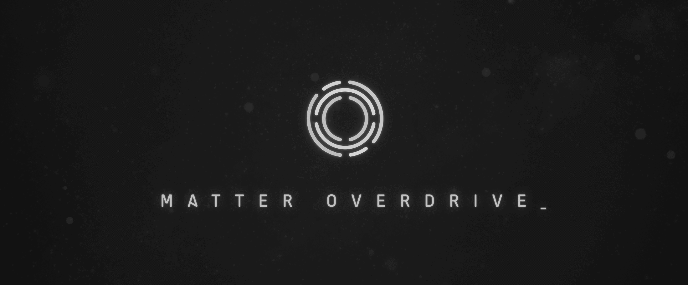

 

# Matter Overdrive - Maintained by Refitbench

## About
Matter Overdrive is a Minecraft mod inspired by the popular Sci-fi TV series Star Trek. It dwells in the concept of replicating and transforming one type matter into another.
Although it may seem overpowered, Matter Overdrive takes a more realistic approach and requires the player to build a complex system before even the simplest replication can be achieved.

## Refit Differences
* Optimized every machine block, remove redundant code, cache states for huge idle overhead gains.
* Optimized cables, instead of checking every tick for neighbors, we cache it.
* Vastly improved and optimized the Anomaly, cache states and queue lookups (configurable).
* Removed items and server logic for incomplete features. (StarMap / Grav Generator).
* Completed the in-progress Tritanium Crate, its now a single block and accepts dye.
* New config options for balance and tinkering by users and modpacks.
* Register items properly, so they show up in the same place, as it should have been.
* Better organize items and blocks to make a bit more logical sense.
* Implemented HEI's collapsible group support.
* Pattern Monitor allows managing tasks from networked replicators.
* Replication requests can be infinite (-1), configurable by server host.
* Bug fixes, fixed a fair amount of bugs and exploits.
* New replication effects and sounds.
* New Recharge Station effects and sounds.

## Mod-Links
* [Discord](https://discord.gg/sgQxDJdrnY)

## Features
* [Matter Scanner](https://mo.simeonradivoev.com/items/matter_scanner/), for scanning matter patterns for replication.
* [Replicator](https://mo.simeonradivoev.com/items/replicator/), for transforming materials.
* [Decomposer](https://mo.simeonradivoev.com/items/decomposer/), for breaking down materials to basic form.
* [Transporter](https://mo.simeonradivoev.com/items/transporter/), for beaming up.
* [Phaser](https://mo.simeonradivoev.com/items/phaser/), to set on stun.
* [Fusion Reactors](https://mo.simeonradivoev.com/fusion-reactor/) and [Gravitational Anomaly](https://mo.simeonradivoev.com/items/gravitational_anomaly/), for that sweet energy.
* Complex Networking for replication control.
* Star Maps, with Galaxies, Stars, and Planets.
* [Androids](https://mo.simeonradivoev.com/android-guide/), become an Android and learn powerful RPG like abilities, such as Teleportation and Forcefields.

## Issues:
https://github.com/Refitbench/MatterOverdrive-CE-Cleanroom/issues
